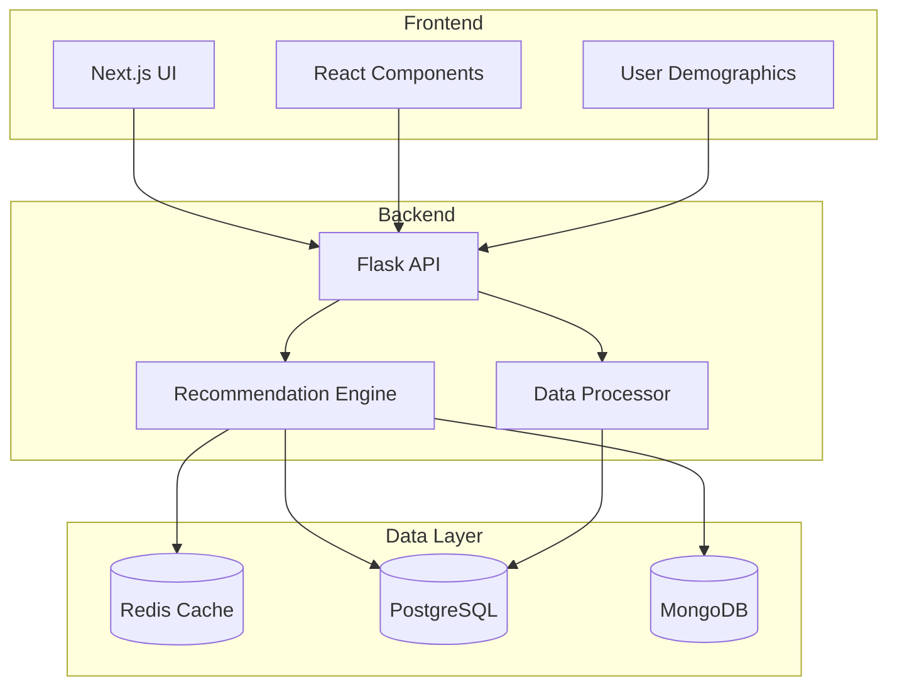
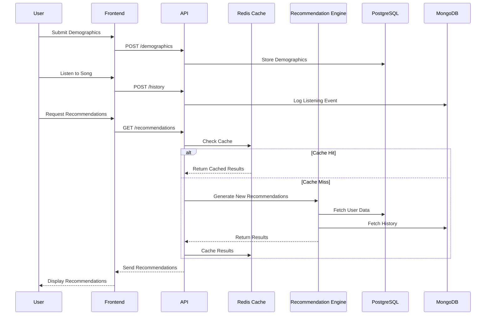

# Neural Music Recommendation System

A hybrid music recommendation system that combines collaborative filtering, content-based features, and demographic data using deep learning. Built on the Free Music Archive (FMA) dataset, this system employs a neural network architecture to provide personalized music recommendations while maintaining user anonymity.

## Core Features

### Recommendation Engine
- Neural network-based hybrid recommendation system
- Content-based filtering using song metadata (genres, tags)
- Implicit feedback processing from user listening history
- Real-time recommendation generation
- Anonymous user profiling with demographic factors

### Data Processing
- Automated FMA dataset processing pipeline
- Efficient metadata extraction and encoding
- Real-time data preprocessing
- Scalable data management system

### User Experience
- Anonymous user interactions
- Demographic-based personalization
- Real-time recommendation updates
- Interactive music discovery interface

## Architecture

### Backend Stack
- **Python 3.x** - Core recommendation engine implementation
- **PyTorch** - Neural network framework for recommendation model
- **Flask** - RESTful API endpoints
- **Pandas** - Data processing and analysis

### Frontend Stack
- **Next.js** - React framework for frontend interface
- **React** - UI components and state management
- **Tailwind CSS** - Responsive design system

### Database Infrastructure
- **PostgreSQL**
  - User demographic data storage
  - Song metadata and details
  - Primary relational database
  
- **MongoDB**
  - User listening history
  - Event-based data storage
  - Flexible schema for interaction data
  
- **Redis**
  - Recommendation caching
  - Performance optimization
  - Temporary data storage

## System Design

### High-Level Architecture


### Data Flow


## Getting Started

### Prerequisites
```bash
# Clone the repository
git clone [repository-url]
cd music-recommender

# Set up Python virtual environment
python -m venv venv
source venv/bin/activate  # Unix
# or
.\venv\Scripts\activate  # Windows

# Install dependencies
pip install -r requirements.txt
```

### Database Setup
```bash
# PostgreSQL
createdb music_recommender

# MongoDB
# Make sure MongoDB is running locally

# Redis
# Ensure Redis server is running
```

### Environment Configuration
Create a `.env` file:
```env
FLASK_APP=app.py
FLASK_ENV=development
POSTGRES_URL=postgresql://localhost:5432/music_recommender
MONGODB_URL=mongodb://localhost:27017/music_recommender
REDIS_URL=redis://localhost:6379
```

[Continue with sections on Dataset, Testing, Deployment, etc.]# musicRecs
