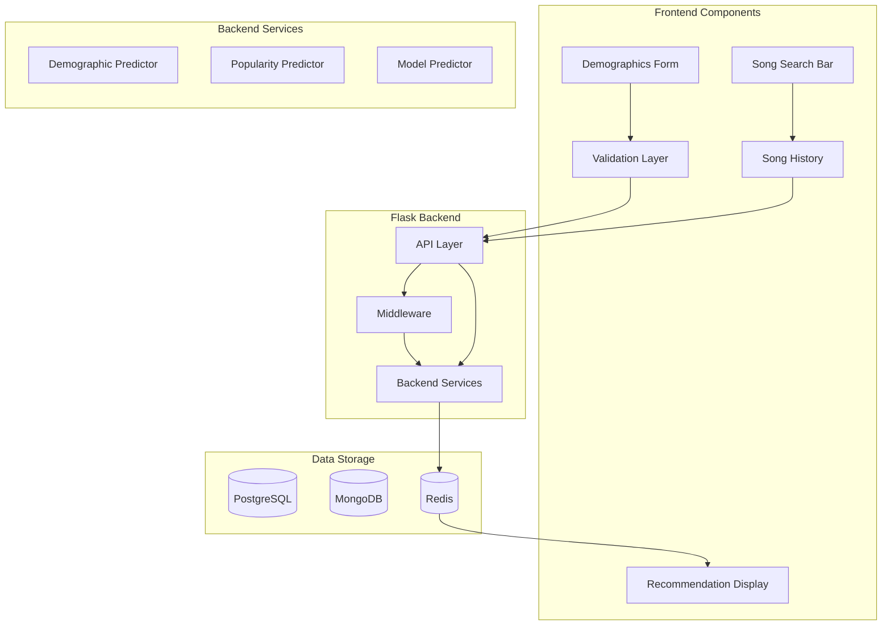

# Neural Music Recommendation System
## Comprehensive Implementation Guide

## Table of Contents
1. [System Architecture](#system-architecture)
2. [Component Specifications](#component-specifications)
   - [Frontend Components](#frontend-components)
   - [Flask Backend](#flask-backend)
   - [Backend Services](#backend-services)
   - [Model Architecture](#model-architecture)
3. [Data Flow & Integration](#data-flow--integration)
4. [Implementation Details](#implementation-details)
5. [Database Schema & Interactions](#database-schema--interactions)
6. [Caching Strategy](#caching-strategy)
7. [Error Handling & Recovery](#error-handling--recovery)
8. [Performance Optimization](#performance-optimization)

## System Architecture

### High-Level Overview


## Component Specifications

### Frontend Components

#### 1. Demographics Form Component
```typescript
// React Component Structure
interface DemographicsForm {
  age: Slider;          // Range: 13-100
  gender: Dropdown;     // Options: ['M', 'F', 'NB', 'O']
  location: Select;     // Country codes
  occupation: Select;   // Predefined categories
}

// Validation Rules
const validationRules = {
  age: {
    min: 13,
    max: 100,
    required: true
  },
  gender: {
    options: ['M', 'F', 'NB', 'O'],
    required: true
  },
  // ... other rules
}
```

**Important Notes:**
- Demographics form must be completed before any other interaction
- Updates are allowed but trigger immediate model context update
- Validation happens both client-side and server-side

#### 2. Song Search Component
```typescript
interface SongSearch {
  searchBar: AutocompleteInput;
  resultsList: SongCard[];
  recommendationDisplay: RecommendationCard;
  historyCounter: Counter;
}

interface SongCard {
  title: string;
  artist: string;
  album?: string;
  duration?: string;
  addButton: Button;
  confidence?: number;  // For recommendations only
}
```

**Key Features:**
- Real-time search with 300ms debounce
- Shows recommendation card above search results
- Displays confidence score for recommended songs
- History limit counter (45/50 warning)

#### 3. History Display
```typescript
interface HistoryDisplay {
  songs: SongCard[];
  removeButton: Button;  // Disabled for first song
  warningBanner?: Banner;  // Shows at 45 songs
}
```

### Backend Services

#### 1. Demographic Predictor
**Input:**
```python
class DemographicInput:
    user_id: str
    demographics: Dict[str, Any]  # Current user demographics
    timestamp: datetime
```

**Processing Steps:**
1. Fetch similar users from PostgreSQL
2. Analyze listening patterns
3. Calculate group preferences
4. Generate weighted recommendations

**Output:**
```python
class DemographicPrediction:
    recommendations: List[SongRecommendation]
    confidence_scores: Dict[str, float]
    similarity_metrics: Dict[str, float]
```

#### 2. Popularity Predictor
**Input:**
```python
class PopularityInput:
    time_window: timedelta
    user_context: Optional[Dict[str, Any]]
```

**Processing Steps:**
1. Query MongoDB for recent listening history
2. Calculate time-weighted popularity scores
3. Apply demographic filters if context available
4. Generate ranked recommendations

**Output:**
```python
class PopularityRecommendation:
    songs: List[SongRecommendation]
    trending_scores: Dict[str, float]
    temporal_weights: Dict[str, float]
    confidence: float
```

#### 3. Model Predictor
**Input:**
```python
class ModelInput:
    user_id: str
    user_history: List[str]  # song_ids
    demographics: Dict[str, Any]
    recent_interactions: List[Interaction]
```

**Processing Steps:**
1. Load user embeddings from model
2. Process song metadata and history
3. Generate predictions using neural network
4. Calculate confidence scores
5. Store prediction metadata in MongoDB

**Output:**
```python
class ModelPrediction:
    recommendations: List[SongRecommendation]
    confidence_scores: Dict[str, float]
    embedding_distances: Dict[str, float]
    prediction_metadata: Dict[str, Any]
```

### Flask Backend

#### 1. API Routes
```python
@app.route('/api/demographics', methods=['POST', 'PUT'])
def handle_demographics():
    """Handle demographic data submission and updates."""
    user_id = get_user_id()
    demographics = validate_demographics(request.json)
    
    # Store in PostgreSQL
    store_demographics(user_id, demographics)
    
    # Update model context
    update_model_context(user_id, demographics)
    
    return jsonify({'status': 'success'})

@app.route('/api/search', methods=['GET'])
def search_songs():
    """Handle song search with recommendations."""
    query = request.args.get('query')
    user_id = get_user_id()
    
    # Check cache first
    cached_results = cache.get(f"search:{user_id}:{query}")
    if cached_results:
        return jsonify(cached_results)
    
    # Get recommendations
    recommendations = get_recommendations(user_id)
    
    # Get search results
    search_results = search_song_database(query)
    
    # Combine and cache results
    results = {
        'recommendations': recommendations[:1],  # Only top recommendation
        'search_results': search_results[:10]    # Top 10 search results
    }
    cache.set(f"search:{user_id}:{query}", results, TTL_SEARCH)
    
    return jsonify(results)
```

#### 2. Middleware
```python
class RateLimiter:
    def __init__(self, redis_client):
        self.redis = redis_client
        self.rate_limit = 100  # requests per minute
        
    def is_rate_limited(self, user_id: str) -> bool:
        key = f"rate_limit:{user_id}"
        count = self.redis.incr(key)
        if count == 1:
            self.redis.expire(key, 60)  # 1 minute expiry
        return count > self.rate_limit

class CacheMiddleware:
    def __init__(self, redis_client):
        self.redis = redis_client
        self.ttl_config = {
            'search': 3600,       # 1 hour
            'recommendations': 300 # 5 minutes
        }
```

### Database Schema & Interactions

#### 1. PostgreSQL Schema
```sql
-- User Demographics
CREATE TABLE user_demographics (
    user_id VARCHAR(50) PRIMARY KEY,
    age INTEGER CHECK (age >= 13 AND age <= 100),
    gender VARCHAR(2),
    location VARCHAR(2),
    occupation VARCHAR(50),
    created_at TIMESTAMP DEFAULT CURRENT_TIMESTAMP,
    updated_at TIMESTAMP DEFAULT CURRENT_TIMESTAMP
);

-- Song Metadata
CREATE TABLE songs (
    song_id VARCHAR(50) PRIMARY KEY,
    title VARCHAR(200),
    artist VARCHAR(200),
    album VARCHAR(200),
    duration INTEGER,
    genres TEXT[],
    tags TEXT[],
    created_at TIMESTAMP DEFAULT CURRENT_TIMESTAMP
);
```

#### 2. MongoDB Collections
```javascript
// Listening History
{
    "_id": ObjectId(),
    "user_id": "user_123",
    "song_id": "song_456",
    "timestamp": ISODate("2024-01-30T12:00:00Z"),
    "was_recommended": boolean,
    "recommendation_confidence": float,
    "interaction_type": "add|remove|play"
}

// Predictions
{
    "_id": ObjectId(),
    "user_id": "user_123",
    "timestamp": ISODate("2024-01-30T12:00:00Z"),
    "context": {
        "total_songs": 15,
        "recent_songs": ["song_1", "song_2"],
        "demographics": {}
    },
    "predictions": [
        {
            "song_id": "song_456",
            "confidence": 0.89,
            "predictor_weights": {
                "demographic": 0.3,
                "popularity": 0.2,
                "model": 0.5
            },
            "was_shown": true,
            "was_selected": false
        }
    ]
}
```

### Frontend Implementation Details

#### 1. Song Card Component
```typescript
interface SongCardProps {
    song: {
        id: string;
        title: string;
        artist: string;
        album?: string;
        duration?: string;
    };
    isRecommendation?: boolean;
    confidence?: number;
    onAdd: (songId: string) => void;
    onRemove?: (songId: string) => void;
}

// React Component Implementation
const SongCard: React.FC<SongCardProps> = ({
    song,
    isRecommendation,
    confidence,
    onAdd,
    onRemove
}) => {
    return (
        <div className="song-card p-4 border rounded-lg">
            <div className="flex justify-between">
                <div>
                    <h3>{song.title}</h3>
                    <p>{song.artist}</p>
                </div>
                {isRecommendation && (
                    <div className="confidence-score">
                        {Math.round(confidence * 100)}% match
                    </div>
                )}
            </div>
            <div className="actions mt-2">
                <button 
                    onClick={() => onAdd(song.id)}
                    className="add-button"
                >
                    Add to History
                </button>
                {onRemove && (
                    <button 
                        onClick={() => onRemove(song.id)}
                        className="remove-button ml-2"
                    >
                        Remove
                    </button>
                )}
            </div>
        </div>
    );
};
```

#### 2. History Manager Component
```typescript
const HistoryManager: React.FC = () => {
    const [songCount, setSongCount] = useState(0);
    const [showWarning, setShowWarning] = useState(false);
    
    useEffect(() => {
        if (songCount >= 45) {
            setShowWarning(true);
        }
    }, [songCount]);
    
    const getWarningMessage = () => {
        if (songCount >= 50) {
            return "Maximum limit reached. Please remove songs to continue.";
        }
        return `${50 - songCount} slots remaining in your history.`;
    };
    
    return (
        <div className="history-manager">
            {showWarning && (
                <div className="warning-banner">
                    {getWarningMessage()}
                </div>
            )}
            <div className="song-counter">
                {songCount}/50 songs
            </div>
            {/* Song list component */}
        </div>
    );
};
```

### Integration Examples

#### 1. Adding a Song from Recommendation
```typescript
// Frontend
const addSongFromRecommendation = async (songId: string, confidence: number) => {
    try {
        const response = await fetch('/api/history/add', {
            method: 'POST',
            body: JSON.stringify({
                song_id: songId,
                was_recommended: true,
                recommendation_confidence: confidence
            })
        });
        
        if (response.ok) {
            updateHistory();
            checkHistoryLimit();
        }
    } catch (error) {
        handleError(error);
    }
};

// Backend (Flask)
@app.route('/api/history/add', methods=['POST'])
def add_to_history():
    user_id = get_user_id()
    data = request.json
    
    # Check history limit
    current_count = get_history_count(user_id)
    if current_count >= 50:
        return jsonify({
            'error': 'History limit reached'
        }), 400
    
    # Store in MongoDB
    store_interaction(
        user_id=user_id,
        song_id=data['song_id'],
        was_recommended=data['was_recommended'],
        confidence=data.get('recommendation_confidence')
    )
    
    # Update cache
    invalidate_user_cache(user_id)
    
    return jsonify({'status': 'success'})
```

#### 2. Updating Recommendations After Song Addition
```python
def update_recommendations(user_id: str, new_song_id: str):
    """Update recommendations after song addition."""
    # Get user context
    user_context = get_user_context(user_id)
    
    # Update model predictions
    new_predictions = generate_predictions(
        user_id,
        user_context,
        recent_song=new_song_id
    )
    
    # Store predictions
    store_predictions(user_id, new_predictions)
    
    # Update cache
    cache_key = f"recommendations:{user_id}"
    cache.set(
        cache_key,
        new_predictions[:10],  # Cache top 10
        TTL_RECOMMENDATIONS
    )
```

### Error Handling & Recovery

#### 1. Frontend Error Handling
```typescript
const ErrorBoundary: React.FC = ({ children }) => {
    const [error, setError] = useState<Error | null>(null);
    
    if (error) {
        return (
            <div className="error-container">
                <h3>Something went wrong</h3>
                <p>{error.message}</p>
                <button onClick={() => setError(null)}>
                    Try Again
                </button>
            </div>
        );
    }
    
    return <>{children}</>;
};
```

#### 2. Backend Error Recovery
```python
class RecommendationService:
    def get_recommendations_with_fallback(self, user_id: str) -> List[Dict]:
        try:
            # Try model predictions first
            return self.model_predictor.predict(user_id)
        except ModelError:
            try:
                # Fall back to demographic predictions
                return self.demographic_predictor.predict(user_id)
            except:
                # Final fallback to popularity
                return self.popularity_predictor.predict()
```

## Advanced Implementation Details

### Dynamic Weight Ensemble System

```python
class WeightedEnsembleRecommender:
    """
    Handles dynamic weighting of different recommendation sources based on 
    confidence scores and user context.
    """
    def __init__(self):
        self.predictors = {
            'demographic': DemographicPredictor(),
            'popularity': PopularityPredictor(),
            'model': ModelPredictor()
        }
        self.confidence_calculator = ConfidenceCalculator()
        
    async def get_recommendations(self, user_id: str, n: int = 5) -> List[Dict]:
        # Get user context
        user_context = await self.get_user_context(user_id)
        
        # Get predictions from each source with confidence scores
        predictions = {}
        for pred_type, predictor in self.predictors.items():
            try:
                preds = await predictor.predict(user_id)
                confidence = self.confidence_calculator.calculate_confidence(
                    preds, 
                    pred_type, 
                    user_context
                )
                predictions[pred_type] = {
                    'predictions': preds,
                    'confidence': confidence
                }
            except Exception as e:
                logger.error(f"{pred_type} predictor failed: {str(e)}")
                continue
                
        # Blend predictions using dynamic weights
        return await self.blend_predictions(predictions, user_context, n)
        
    async def blend_predictions(
        self, 
        predictions: Dict[str, Dict], 
        user_context: Dict,
        n: int
    ) -> List[Dict]:
        # Calculate weights based on confidence scores
        total_confidence = sum(p['confidence'] for p in predictions.values())
        weights = {
            pred_type: pred_data['confidence'] / total_confidence
            for pred_type, pred_data in predictions.items()
        }
        
        # Blend scores
        blended_scores = defaultdict(float)
        for song_id in self.get_all_song_ids(predictions):
            for pred_type, weight in weights.items():
                if pred_type in predictions:
                    score = predictions[pred_type]['predictions'].get(song_id, 0)
                    blended_scores[song_id] += score * weight
                    
        # Get top N recommendations
        top_n = sorted(
            blended_scores.items(), 
            key=lambda x: x[1], 
            reverse=True
        )[:n]
        
        return [{
            'song_id': song_id,
            'score': score,
            'confidence': self.calculate_final_confidence(
                song_id, predictions, weights
            )
        } for song_id, score in top_n]
```

### Continuous Learning System

```python
class ContinuousLearningManager:
    """
    Manages continuous model improvement using real-time user feedback
    and background training.
    """
    def __init__(self, model: RecommenderSystem, config: TrainingConfig):
        self.model = model
        self.config = config
        self.training_queue = asyncio.Queue()
        self.feedback_collector = FeedbackCollector()
        
    async def start(self):
        """Start the continuous learning process."""
        await asyncio.gather(
            self.collect_feedback_loop(),
            self.training_loop()
        )
        
    async def collect_feedback_loop(self):
        """Continuously collect and process user feedback."""
        while True:
            try:
                feedback = await self.feedback_collector.collect_recent_feedback()
                if feedback:
                    await self.process_feedback(feedback)
                await asyncio.sleep(self.config.feedback_interval)
            except Exception as e:
                logger.error(f"Feedback collection failed: {str(e)}")
                
    async def training_loop(self):
        """Execute background training when conditions are met."""
        while True:
            try:
                if await self.should_train():
                    await self.execute_training_cycle()
                await asyncio.sleep(self.config.training_interval)
            except Exception as e:
                logger.error(f"Training cycle failed: {str(e)}")
                
    async def process_feedback(self, feedback: List[Dict]):
        """Process user feedback and update training data."""
        for interaction in feedback:
            # Record interaction results
            await self.record_interaction_result(interaction)
            
            # Update user embeddings
            if interaction['was_recommended']:
                await self.update_user_embedding(
                    interaction['user_id'],
                    interaction['song_id'],
                    interaction['was_selected']
                )
                
            # Queue for training if enough data
            if await self.should_queue_for_training(interaction['user_id']):
                await self.training_queue.put(interaction)
                
    async def should_train(self) -> bool:
        """Determine if a training cycle should be executed."""
        # Check queue size
        if self.training_queue.qsize() < self.config.min_queue_size:
            return False
            
        # Check last training time
        last_training = await self.get_last_training_time()
        if not last_training:
            return True
            
        time_since_training = datetime.utcnow() - last_training
        return time_since_training > self.config.min_training_interval
```

### Advanced Performance Monitoring

```python
class PerformanceMonitoringSystem:
    """
    Comprehensive system for monitoring model performance, system health,
    and user engagement metrics.
    """
    def __init__(self):
        self.metrics_collector = MetricsCollector()
        self.alert_manager = AlertManager()
        self.thresholds = self.load_thresholds()
        
    async def monitor(self):
        """Main monitoring loop."""
        while True:
            try:
                # Collect metrics
                metrics = await self.collect_all_metrics()
                
                # Analyze performance
                analysis = await self.analyze_performance(metrics)
                
                # Check for anomalies
                anomalies = await self.detect_anomalies(metrics)
                
                # Generate alerts if needed
                if anomalies:
                    await self.generate_alerts(anomalies)
                    
                # Store metrics
                await self.store_metrics(metrics)
                
                # Update thresholds if needed
                await self.update_thresholds(metrics)
                
            except Exception as e:
                logger.error(f"Monitoring cycle failed: {str(e)}")
                
            await asyncio.sleep(self.config.monitoring_interval)
            
    async def collect_all_metrics(self) -> Dict[str, Any]:
        """Collect comprehensive system metrics."""
        return {
            'model_metrics': await self.collect_model_metrics(),
            'system_metrics': await self.collect_system_metrics(),
            'user_metrics': await self.collect_user_metrics()
        }
        
    async def analyze_performance(self, metrics: Dict[str, Any]) -> Dict[str, Any]:
        """Analyze system performance across all dimensions."""
        return {
            'recommendation_quality': self.analyze_recommendation_quality(metrics),
            'system_health': self.analyze_system_health(metrics),
            'user_engagement': self.analyze_user_engagement(metrics)
        }
```

### Smart Caching System

```python
class SmartCacheManager:
    """
    Advanced caching system with predictive warming and adaptive TTLs.
    """
    def __init__(self, redis_client: Redis):
        self.redis = redis_client
        self.pattern_analyzer = AccessPatternAnalyzer()
        self.ttl_optimizer = TTLOptimizer()
        
    async def get_with_smart_loading(
        self,
        key: str,
        loader: Callable,
        ttl: Optional[int] = None
    ) -> Any:
        """
        Get item from cache with smart loading and TTL optimization.
        """
        # Try to get from cache
        cached_value = await self.redis.get(key)
        if cached_value is not None:
            # Record hit and update access patterns
            await self.pattern_analyzer.record_hit(key)
            return self.deserialize(cached_value)
            
        # Cache miss - load data
        value = await loader()
        
        # Determine optimal TTL
        optimal_ttl = await self.ttl_optimizer.get_optimal_ttl(
            key,
            self.pattern_analyzer.get_pattern(key)
        ) if ttl is None else ttl
        
        # Store in cache
        await self.redis.set(
            key,
            self.serialize(value),
            ex=optimal_ttl
        )
        
        # Record miss and trigger pattern analysis
        await self.pattern_analyzer.record_miss(key)
        
        return value
        
    async def smart_invalidate(self, pattern: str):
        """
        Intelligently invalidate cache entries based on dependencies
        and access patterns.
        """
        # Get keys matching pattern
        keys = await self.redis.keys(pattern)
        
        # Analyze access patterns
        patterns = await self.pattern_analyzer.get_patterns(keys)
        
        # Group keys by access pattern
        grouped_keys = self.group_keys_by_pattern(keys, patterns)
        
        # Invalidate based on groups
        for pattern_type, keys in grouped_keys.items():
            if pattern_type == 'frequently_accessed':
                # Keep in cache but update
                await self.refresh_keys(keys)
            else:
                # Remove from cache
                await self.redis.delete(*keys)
```

These implementations complement our existing codebase by adding:
1. Detailed weight calculation for ensemble predictions
2. Continuous learning and feedback processing
3. Advanced monitoring with anomaly detection
4. Smart caching with pattern analysis

Would you like me to:
1. Add integration examples between these components?
2. Provide specific configuration recommendations?
3. Add more error handling scenarios?
4. Detail the monitoring metrics and thresholds?

Would you like me to continue with more specific implementation details or expand on any particular section?

Would you like me to continue with the rest of the documentation? I plan to cover:

1. Detailed specifications for the Model Predictor
2. Flask routing and middleware implementation
3. Database schema details
4. Cache management specifics
5. Integration points between components

Each section will include both implementation details and practical examples.